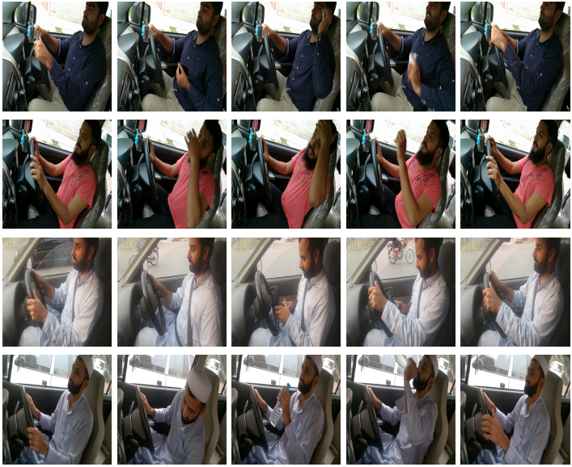

# Dataset: Video based Driver Activity Recognition

Please send a request to the following email-id, we will send back the link for downloading the dataset: 

humza_naveed@yahoo.com 



Please cite the following article, if you use this dataset. 
<br />
<br />
```
@article{naveed2021driver,
  title={Driver activity recognition by learning spatiotemporal features of pose and human object interaction},
  author={Naveed, Humza and Jafri, Fareed and Javed, Kashif and Babri, Haroon Atique},
  journal={Journal of Visual Communication and Image Representation},
  pages={103135},
  year={2021},
  publisher={Elsevier}
}
```
